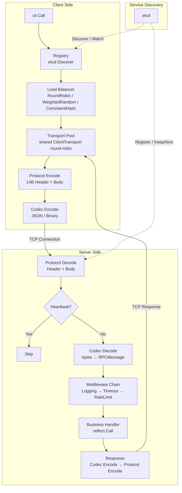
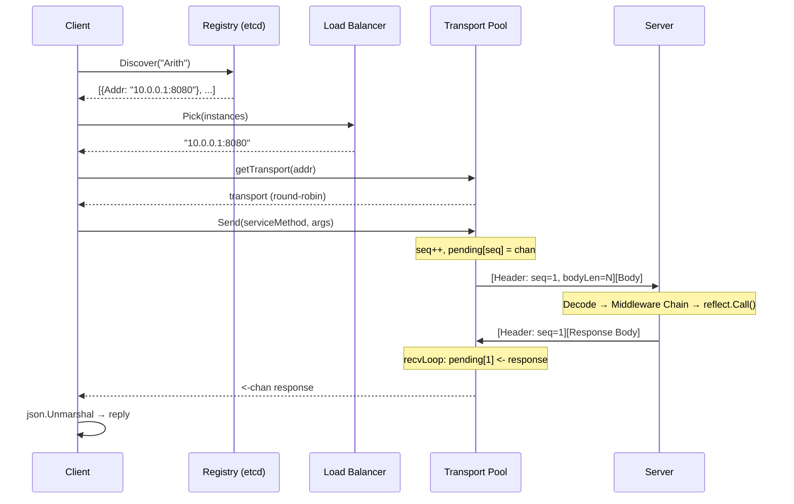

# Mini-RPC

A lightweight RPC framework built from scratch in Go, designed to demonstrate deep understanding of RPC internals.

## Features

- **Custom Binary Protocol** — 14-byte fixed header with magic number, sequence ID, and length prefix to solve TCP sticky packet problem
- **Dual Codec** — JSON and Binary serialization with pluggable `Codec` interface
- **Connection Pool + Multiplexing** — Shared transport pool with round-robin selection; each transport supports multiplexed concurrent requests via sequence ID matching
- **Service Discovery** — etcd-based registry with TTL lease, KeepAlive, and Watch for real-time instance awareness
- **Load Balancing** — Round-Robin, Weighted Random, and Consistent Hash (with virtual nodes)
- **Middleware Chain** — Onion model supporting Logging, Timeout, and Rate Limiting (token bucket)
- **Graceful Shutdown** — Deregister from etcd → close listener → wait for in-flight requests with timeout
- **Heartbeat KeepAlive** — Periodic heartbeat frames to detect dead connections
- **Server Parallel Processing** — Per-connection write mutex enables concurrent request handling on a single connection

## Architecture



### Data Flow of a Single RPC Call



## Frame Format

```
 0      3  4  5  6         10        14
 ┌──────┬──┬──┬──┬─────────┬─────────┬───────────────┐
 │magic │v │ct│mt│   seq   │ bodyLen │    body ...   │
 │ mrp  │01│  │  │ uint32  │ uint32  │ bodyLen bytes │
 └──────┴──┴──┴──┴─────────┴─────────┴───────────────┘

 magic   : 0x6d7270 ("mrp") — protocol identification
 v       : version (0x01)
 ct      : codec type (0=JSON, 1=Binary)
 mt      : message type (0=Request, 1=Response, 2=Heartbeat)
 seq     : sequence ID for multiplexing
 bodyLen : body length in bytes (solves TCP sticky packet)
```

## Project Structure

```
mini-rpc/
├── protocol/       # Frame encoding/decoding (14-byte header + variable body)
├── codec/          # Serialization: JSON codec + Binary codec
├── message/        # RPCMessage struct (ServiceMethod, Payload, Error)
├── transport/      # ClientTransport: multiplexing, recvLoop, heartbeat
├── server/         # Service registration (reflection), middleware integration
├── client/         # Registry + LB + shared transport pool + Call()
├── registry/       # etcd-based service discovery (Register/Discover/Watch)
├── loadbalance/    # RoundRobin, WeightedRandom, ConsistentHash
├── middleware/     # Onion model: Logging, Timeout, RateLimit
└── test/           # Integration tests + benchmarks
```

## Quick Start

### Server

```go
package main

import (
    "mini-rpc/middleware"
    "mini-rpc/registry"
    "mini-rpc/server"
)

type Args struct{ A, B int }
type Reply struct{ Result int }
type Arith struct{}

func (a *Arith) Add(args *Args, reply *Reply) error {
    reply.Result = args.A + args.B
    return nil
}

func main() {
    reg, _ := registry.NewEtcdRegistry([]string{"127.0.0.1:2379"})

    svr := server.NewServer()
    svr.Use(middleware.LoggingMiddleware())
    svr.Register(&Arith{})
    svr.Serve("tcp", ":8080", "127.0.0.1:8080", reg)
}
```

### Client

```go
package main

import (
    "fmt"
    "mini-rpc/client"
    "mini-rpc/codec"
    "mini-rpc/loadbalance"
    "mini-rpc/registry"
)

func main() {
    reg, _ := registry.NewEtcdRegistry([]string{"127.0.0.1:2379"})
    bal := &loadbalance.RoundRobinBalancer{}
    cli := client.NewClient(reg, bal, byte(codec.CodecTypeJSON), 4)

    var reply struct{ Result int }
    err := cli.Call("Arith.Add", &struct{ A, B int }{A: 1, B: 2}, &reply)
    fmt.Println(reply.Result, err) // 3 <nil>
}
```

## Benchmark

Tested on Apple M4 Pro (14-core), macOS, Go 1.24, localhost TCP.

```
goos: darwin
goarch: arm64
cpu: Apple M4 Pro

Benchmark                      ops        ns/op     B/op    allocs/op
──────────────────────────────────────────────────────────────────────
SerialCall                  103,990      33,719     2,033       48
ConcurrentCall              155,276      22,420     2,041       48
SlowSerialCall (1ms handler)  2,815   1,258,596     2,133       48
SlowConcurrentCall            40,701     88,761     2,137       49
CodecJSON                 6,187,383         589       392        8
CodecBinary              56,144,983          65       128        4
```

### Key Takeaways

| Insight | Data |
|---------|------|
| Multiplexing speedup (concurrent vs serial) | 33μs → 22μs (**1.5x**) |
| Server parallelization speedup (slow handler) | 1,258μs → 88μs (**14x**, matching CPU core count) |
| Binary codec vs JSON codec | 65ns vs 589ns (**9x faster**) |
| CPU bottleneck (pprof) | 82% in syscall (network I/O), codec/reflect negligible |

### Profiling

```bash
# Generate CPU profile
go test ./test/ -bench=BenchmarkSerialCall -cpuprofile=cpu.prof -benchtime=3s

# View flame graph in browser
go tool pprof -http=:6060 cpu.prof
```

## Design Decisions

| Decision | Rationale |
|----------|-----------|
| Fixed-size header (not varint) | Constant-time parsing, only 14 bytes overhead |
| `sync.Map` for pending requests | Lock-free concurrent access from Send() and recvLoop() |
| Shared transport pool (not borrow/return) | Multiplexed transports should be shared, not exclusively held — holding during entire Call() wastes 95% of transport time on idle waiting |
| Per-connection write mutex on server | Enables parallel request processing per connection while preventing frame interleaving on writes |
| `leaseID` as local variable (not struct field) | Prevents data race when multiple servers share one EtcdRegistry instance |
| `atomic.AddUint64` for transport round-robin | Lock-free counter, each goroutine captures its own value to avoid race |

## Running Tests

```bash
# Unit tests (no etcd required)
go test ./client/ ./middleware/ ./loadbalance/ ./protocol/ ./codec/ -v

# Integration tests (requires etcd on localhost:2379)
go test ./test/ -run Test -v

# Benchmark
go test ./test/ -bench=. -benchmem

# Race detector
go test -race ./client/ ./middleware/ ./loadbalance/ ./test/ -run Test
```

## Dependencies

- `go.etcd.io/etcd/client/v3` — etcd client for service discovery
- `golang.org/x/time/rate` — Token bucket rate limiter